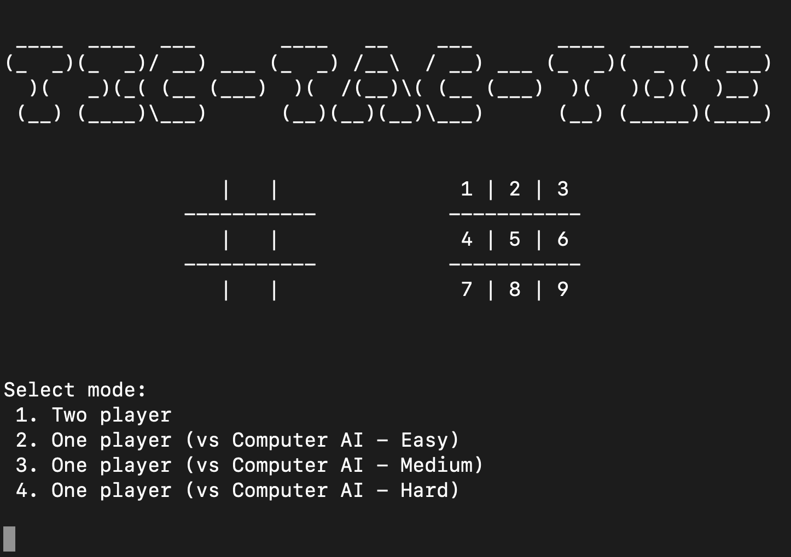
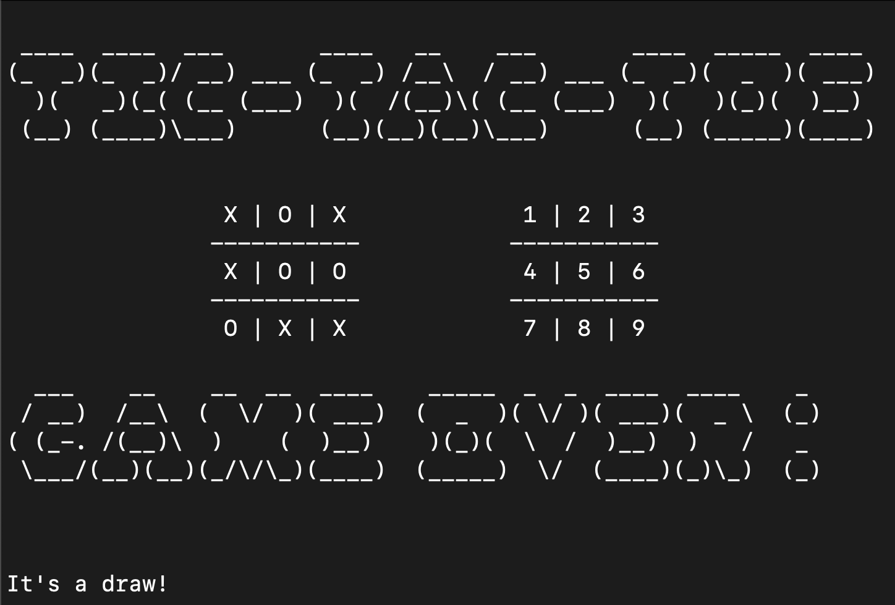

# Tic Tac Toe (Python)

## 📌 Overview
This is a command-line Tic Tac Toe game built using Python. It supports a two-player mode and also includes an AI opponent with three difficulty levels: Easy, Medium, and Hard.

## 🎮 How to Play
1. Run the script in a terminal.
2. Choose game mode:
   - 2-player mode
   - Play against AI (coming soon: Easy, Medium, Hard levels)
3. Players take turns selecting a position (1-9) on the board.
4. The first player to get three in a row wins!
5. If all spaces are filled and no one wins, the game ends in a draw.

## 🛠 Features
✅ Command-line interface for a classic feel.
✅ 2-player mode.
✅ AI opponent with selectable difficulty (tic_tac_toe_v0.2.py).
✅ Input validation to prevent invalid moves.
✅ Automatic win/draw detection.

## 🚀 Installation & Setup
### **Prerequisites:**
- Python 3.x installed

### **Steps to Run:**
1. Clone the repository:
   ```sh
   git clone https://github.com/Garschke/tic-tac-toe.git
   ```
2. Navigate to the project folder:
   ```sh
   cd tic-tac-toe
   ```
3. Run the game:
   ```sh
   python3 tic_tac_toe_v0.2.py
   ```

## 🖥️ Demo
Screenshot showing program in action.
Starting screen with player modes.


Game Over screen - result draw or winner.


## 🔮 Future Improvements
 ✅ Implement AI difficulty levels: Easy, Medium, Hard.
- [ ] Enhance board visuals.
- [ ] Add a GUI version using Tkinter or Pygame.

## 🤝 Contributing
Feel free to fork the repo and submit pull requests!

## 🐍 Fork the repository.
1. Create your feature branch: git checkout -b feature/NewFeature
2. Commit your changes: git commit -m 'Add new feature'
3. Push to the branch: git push origin feature/NewFeature
4. Open a pull request.

## 📜 License
This project is open-source and available under the MIT License.

---
Happy coding! 🎉

